# TavernVault 架构与流程可视化

> 配套 `docs/development-handoff.md` §2-§3 的图集。所有图为 Mermaid 源码，可在 GitHub / VS Code（Mermaid 插件）直接渲染。
> 最后更新：2026-08-31 · 对应 v0.4.1

## 1. 系统分层架构

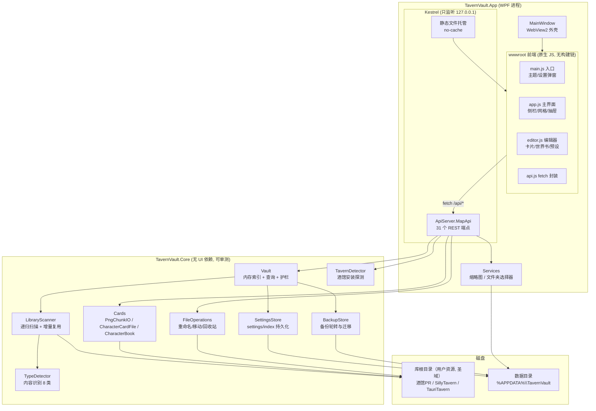

## 2. 启动流程

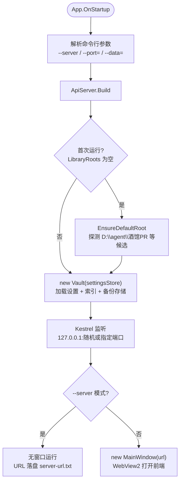

## 3. 一次"编辑角色卡并保存"的完整时序

所有覆盖写入共用这条安全链路：**先备份 → 写盘 → 重扫**。

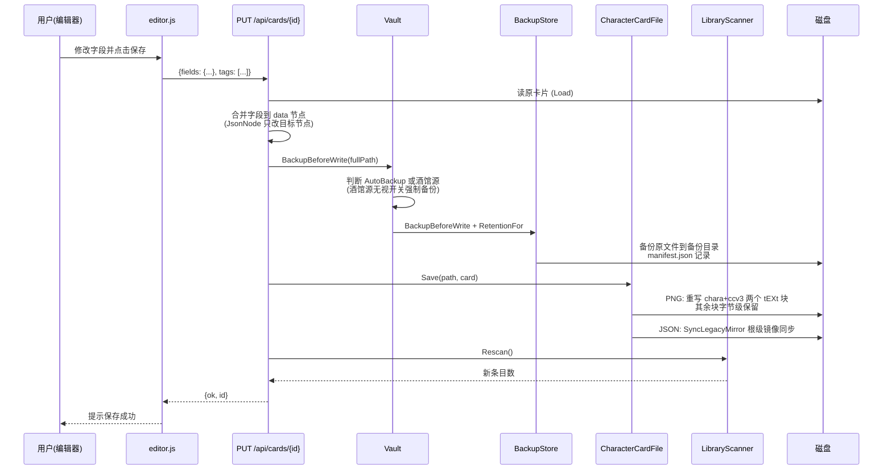

## 4. 扫描与增量索引

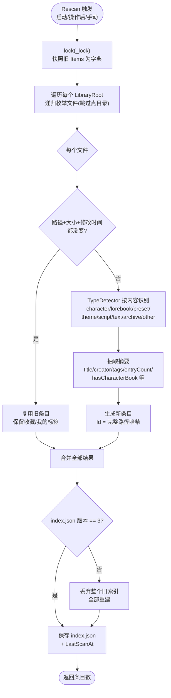

## 5. 备份生命周期（单文件视角）

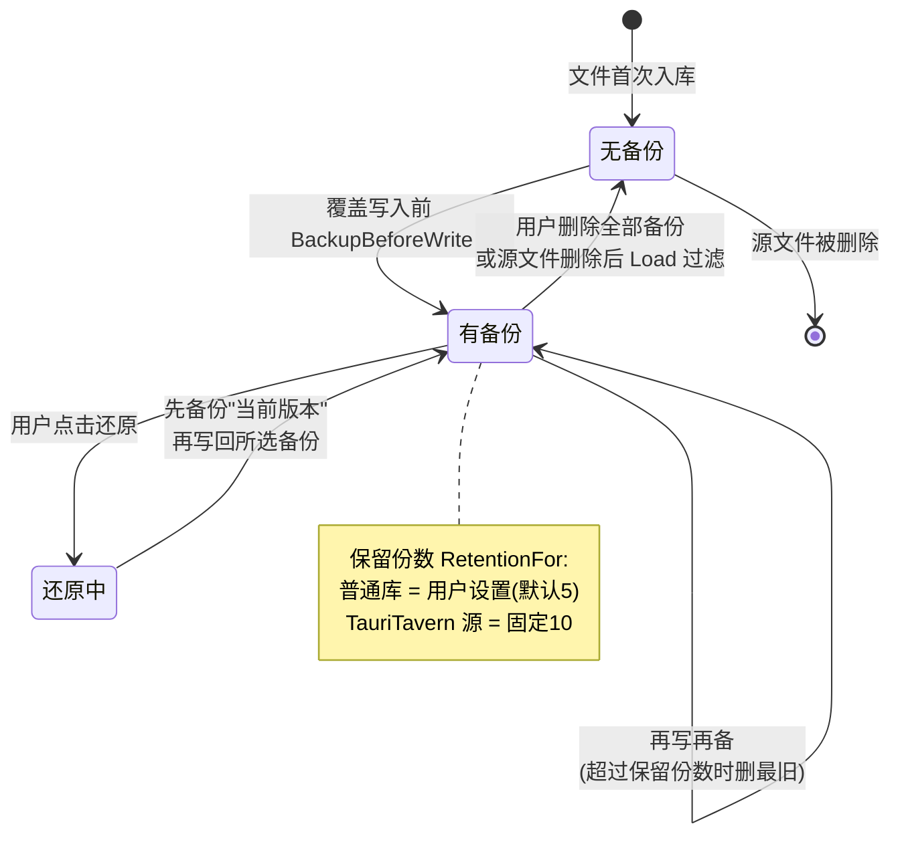

## 6. 备份位置自定义与迁移（v0.4.1）

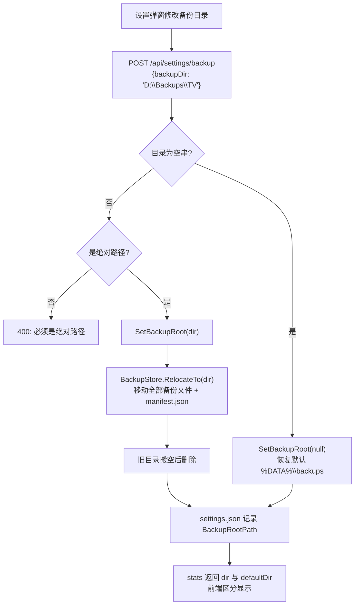

## 7. 酒馆接入流程（v0.4.0）

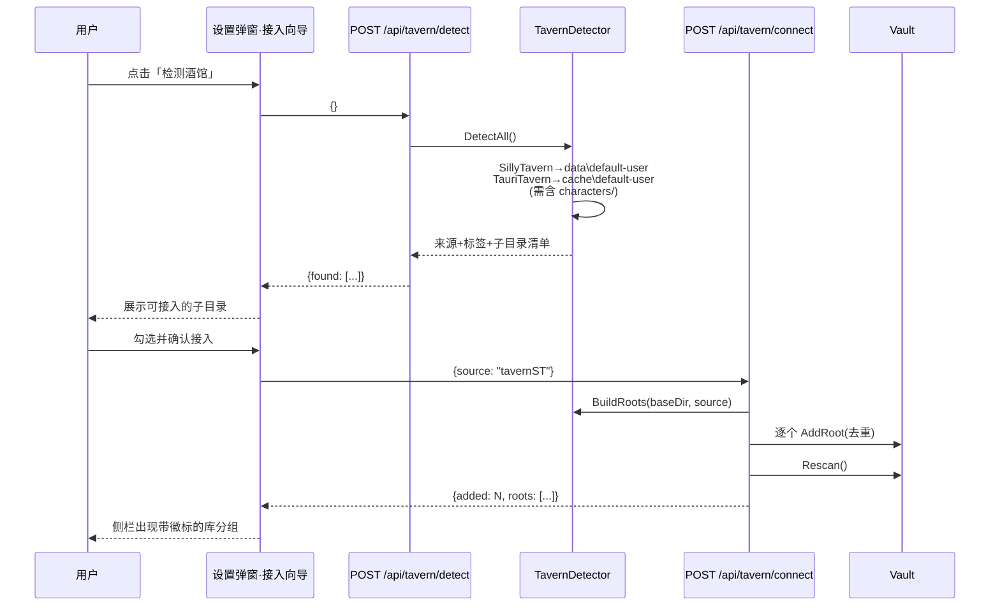

## 8. 重命名/移动护栏决策树

```mermaid
flowchart TD
    Req["POST /api/items/{id}/rename 或 /move"] --> Find["vault.Find(id)"]
    Find --> Guard{"item.RootSource<br/>!= Normal ?"}
    Guard -->|"否(普通库)"--> Snap["取用户数据快照<br/>(收藏+标签)"]
    Guard -->|"是(酒馆源)"--> Force{"请求带 force:true ?"}
    Force -->|"否"| R403["403: 酒馆聊天按文件名/路径<br/>引用角色卡, 拒绝"]
    Force -->|"是"| Confirm["前端已弹风险确认框"] --> Snap
    Snap --> BK["BackupBeforeWrite"]
    BK --> Op["FileOperations.Rename / Move<br/>(move 先 GuardUnderRoots<br/>目标必须在库根内)"]
    Op --> RS["Rescan()"]
    RS --> Migrate["SetUserData(newId, 快照)<br/>Id 随路径变化, 迁移用户数据"]
    Migrate --> OK["{ok, id: newId}"]
```

## 9. 库根分组浏览数据流（v0.4.1）

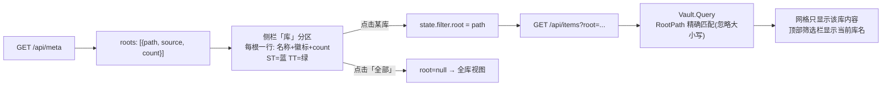

## 10. 磁盘目录拓扑

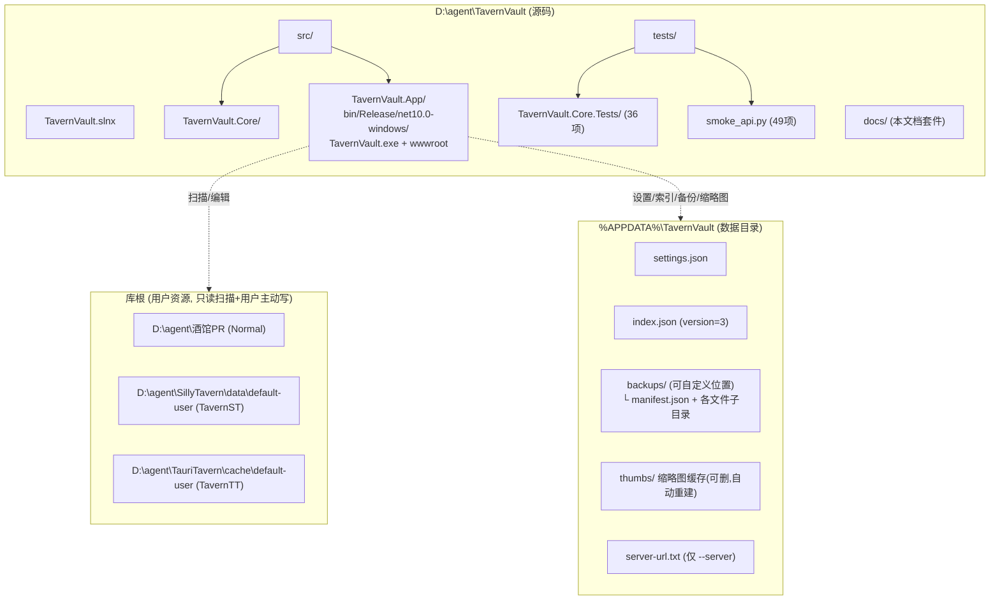

## 11. 版本演进

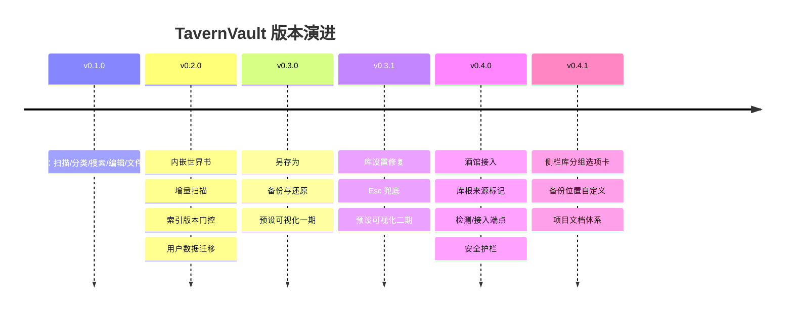

## 12. 风险与防护措施对照

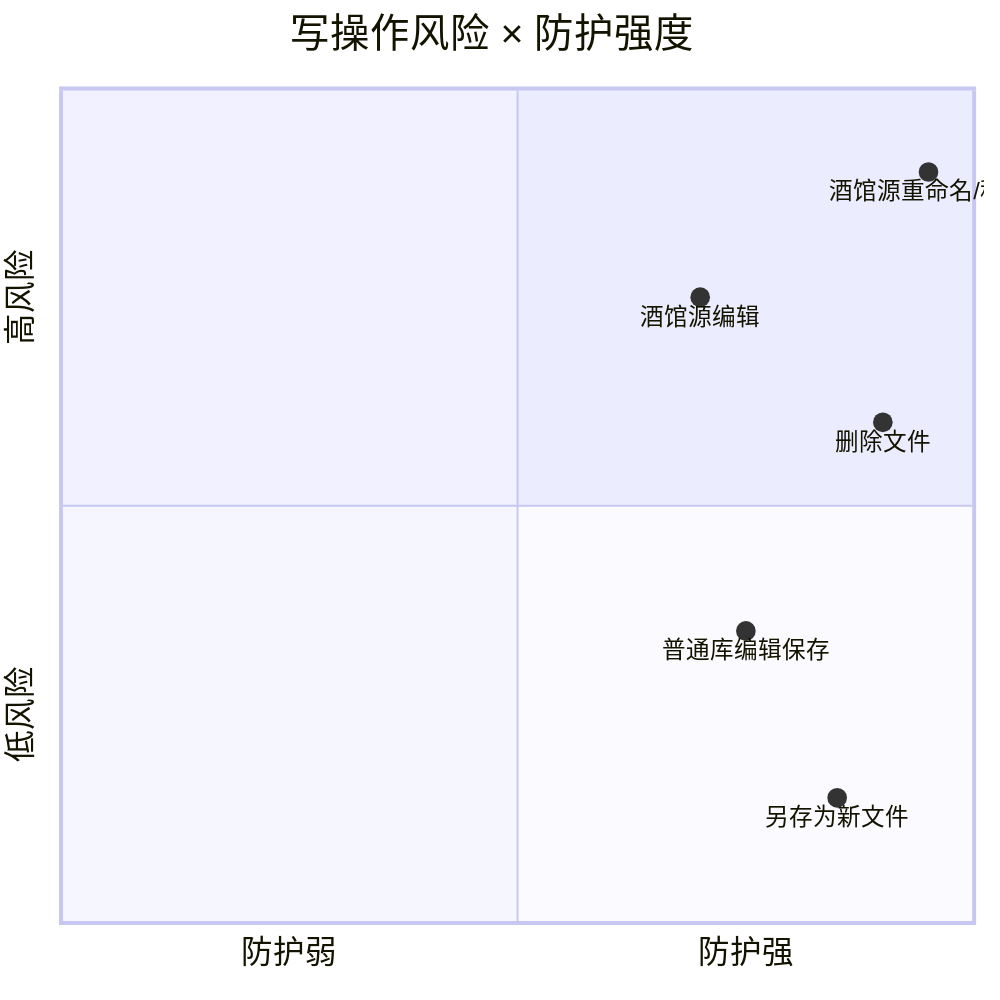

说明：删除走系统回收站（可找回）；酒馆源重命名/移动是唯一"默认拒绝"的操作（403 + force 确认 + 强制备份 + TT 高保留份数四重防护）。
