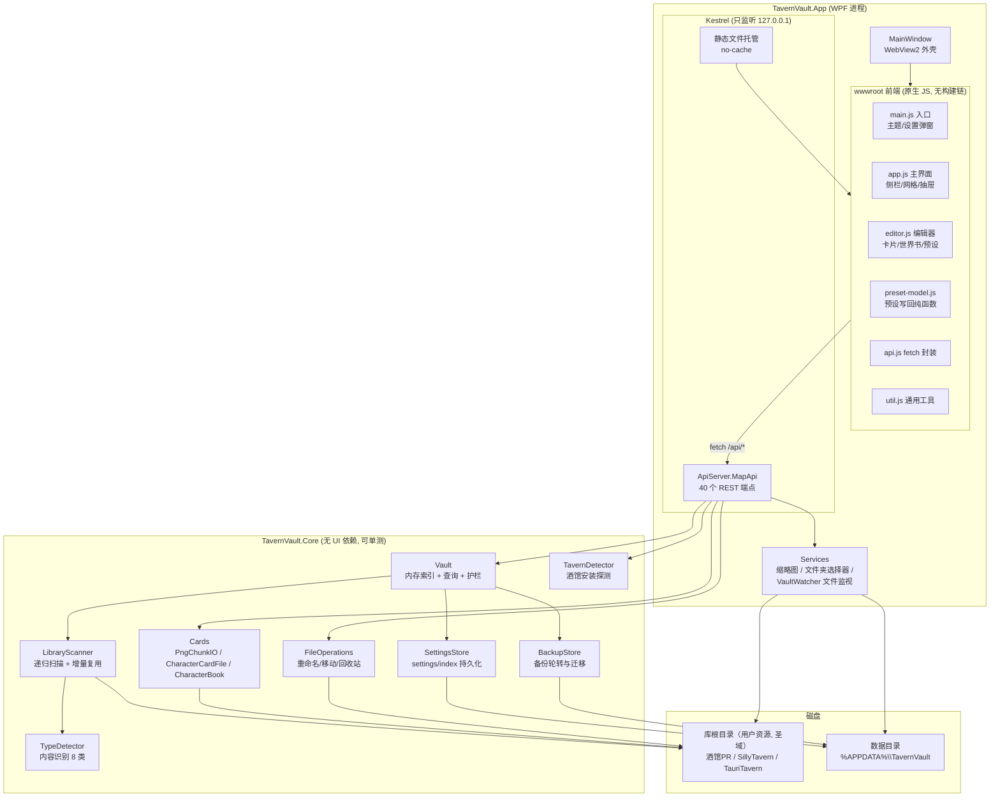
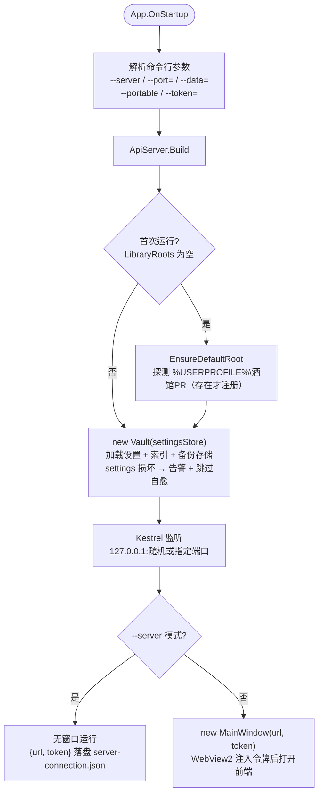
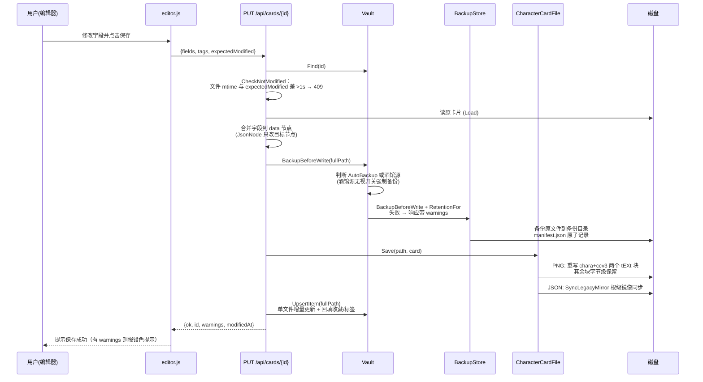
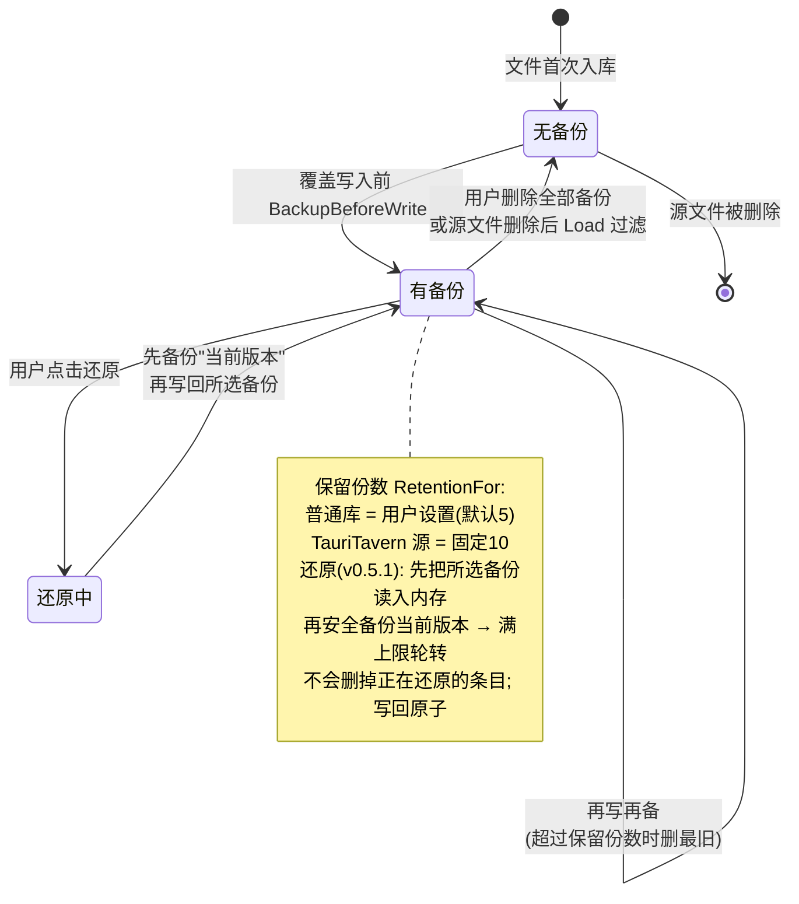
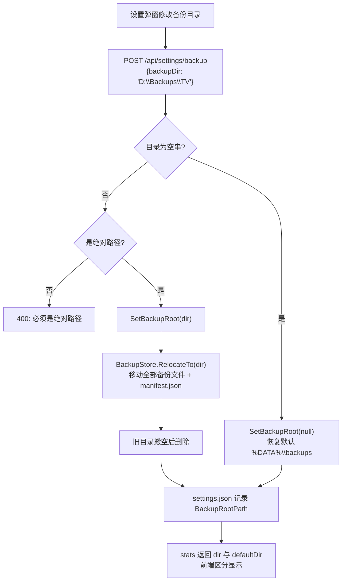
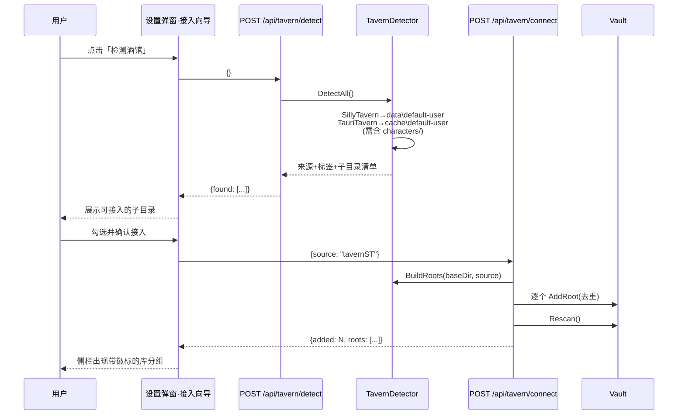
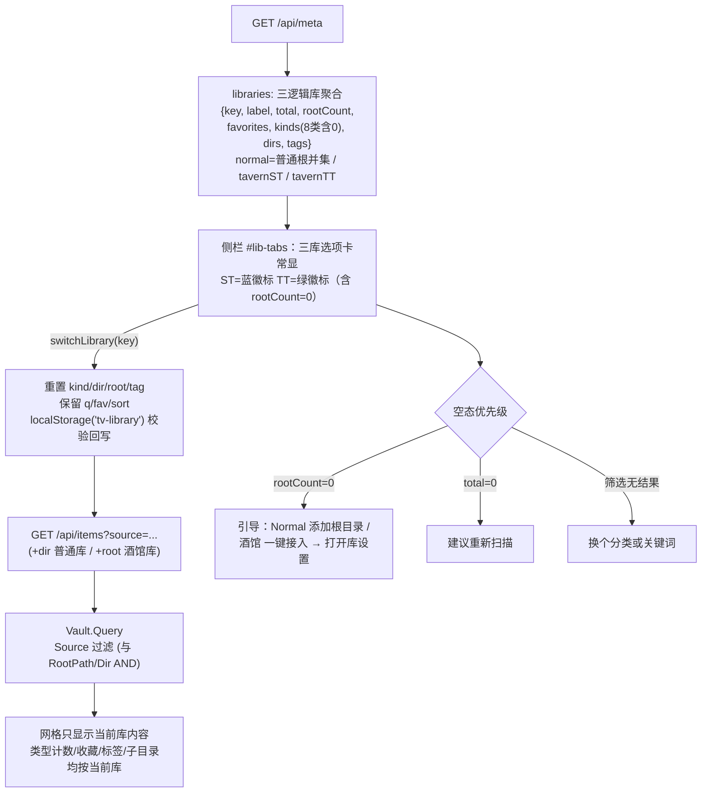
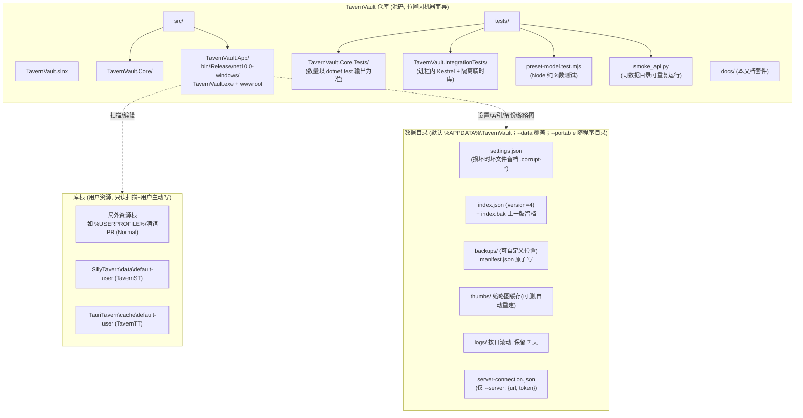
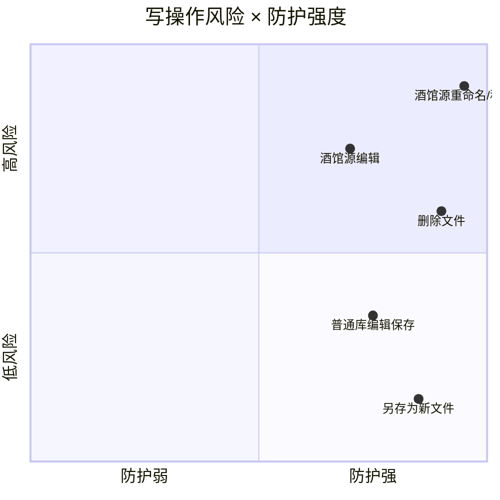

# TavernVault 架构与流程可视化

> 配套 `docs/development-handoff.md` §2-§3 的图集。所有图为 Mermaid 源码，可在 GitHub / VS Code（Mermaid 插件）直接渲染。
> 最后更新：2026-09-05 · 对应 v1.0.0

## 1. 系统分层架构



## 2. 启动流程



## 3. 一次"编辑角色卡并保存"的完整时序

所有覆盖写入共用这条安全链路：**备份 → 写盘 → 单文件增量更新索引**（v0.5.0 起不再全量 Rescan）。



## 4. 扫描与增量索引

```mermaid
flowchart TD
    Start(["Rescan 触发<br/>启动/操作后/手动"]) --> Lock["lock(_lock)<br/>快照旧 Items 为字典"]
    Lock --> ForEach["遍历每个 LibraryRoot<br/>递归枚举文件(跳过点目录)"]
    ForEach --> EachFile{"每个文件"}
    EachFile --> Stable{"路径+大小+修改时间<br/>都没变?"}
    Stable -->|"是"| Reuse["复用旧条目<br/>保留收藏/我的标签"]
    Stable -->|"否"| Detect["TypeDetector 按内容识别<br/>character/lorebook/preset/<br/>theme/script/text/archive/other"]
    Detect --> Digest["抽取摘要<br/>title/creator/tags/entryCount/<br/>hasCharacterBook 等"]
    Digest --> NewItem["生成新条目<br/>Id = 完整路径哈希"]
    Reuse --> Merge["合并全部结果"]
    NewItem --> Merge
    Merge --> Persist["保存 index.json<br/>(tmp+Move 原子写, 旧版留档 index.bak)"]
    Persist --> Done(["返回条目数"])

    note right of Start
        索引版本门控在 LoadIndex（启动加载时）：
        version != 4（当前 IndexVersion）直接丢弃旧索引返回空，
        由本次全量扫描重建——不在扫描尾部判断
    end note
```

## 5. 备份生命周期（单文件视角）



## 6. 备份位置自定义与迁移（v0.4.1）



## 7. 酒馆接入流程（v0.4.0）



## 8. 重命名/移动护栏决策树

```mermaid
flowchart TD
    Req["POST /api/items/{id}/rename 或 /move"] --> Find["vault.Find(id)"]
    Find --> Guard{"item.RootSource<br/>!= Normal ?"}
    Guard -->|"否(普通库)"--> Snap["取用户数据快照<br/>(收藏+标签)"]
    Guard -->|"是(酒馆源)"--> Force{"请求带 force:true ?"}
    Force -->|"否"| R403["403: 酒馆聊天按文件名/路径<br/>引用角色卡, 拒绝"]
    Force -->|"是"| Confirm["前端已弹风险确认框"] --> Snap
    Snap --> BK["BackupBeforeWrite<br/>(rename/move 均已接入, v0.5.2 起 move 也备份)"]
    BK --> Op["FileOperations.Rename / Move<br/>(move 先 GuardUnderRoots<br/>目标必须在库根内)"]
    Op --> RS["RemoveItem(旧路径)<br/>+ UpsertItem(新路径)<br/>+ SetUserData 迁移收藏/标签"]
    RS --> OK["{ok, id: newId}"]
```

## 9. 三逻辑库选项卡数据流（v0.4.2）



## 10. 磁盘目录拓扑



## 11. 版本演进

```mermaid
timeline
    title TavernVault 版本演进
    v0.1.0 : 初版：扫描/分类/搜索/编辑/文件操作
    v0.2.0 : 内嵌世界书 : 增量扫描 : 索引版本门控 : 用户数据迁移
    v0.3.0 : 另存为 : 备份与还原 : 预设可视化一期
    v0.3.1 : 库设置修复 : Esc 兜底 : 预设可视化二期
    v0.4.0 : 酒馆接入 : 库根来源标记 : 检测/接入端点 : 安全护栏
    v0.4.1 : 侧栏库分组选项卡 : 备份位置自定义 : 项目文档体系
    v0.4.2 : 三逻辑库选项卡 : 每库独立分类+二级子目录 : 来源过滤+冷升级自愈
    v0.4.3 : 侧栏手风琴+滚动隔离(含弹窗滚动修复) : 探测去硬编码(可移植性起步)
    v0.5.0 : 深度优化：PNG另存为损坏修复+会话令牌/Host校验 : 备份告警+滚动日志+原子写 : 增量更新+并发409+单实例
    v0.5.1 : 安全加固：预设可视化XSS修复+junction/路径逃逸封堵 : 设置损坏防护+index.bak+还原自逐出修复 : 冒烟同目录可重复
    v0.5.2 : 备份Load不丢记录+RelocateTo两阶段 : 编辑器重构(互刷/Esc/409自动重扫)+move备份 : 酒馆护栏测试+错误合同补齐
    v0.5.3 : v0.5.x收尾：UI清单12项实跑(?token=通道) : 奥卡姆剃刀修剪无用代码
    v0.6.0 : 格式对齐：识别13类官方格式+主题字段修正 : 独立世界书容器保形 : 新建文件11类模板(创建即编辑)
    v0.6.1 : 分类回撤(奥卡姆剃刀) : 新建模板收敛6类 : 首次自包含打包
    v0.7.0 : 预设可视化三期(拖拽/增删/分组) : preset-model 纯函数+Node测试 : MIT 开源定位
    v0.7.1 : 酒馆只读托管+导出副本 : 修改历史+数据目录可视化
    v0.7.2 : 文件监视自动重扫(防抖+轮询) : 冒烟复审
    v0.7.3 : 收纳入库(散乱目录批量分类进库)
    v0.7.4 : 集成测试进 dotnet test : GitHub Actions CI
    v0.7.5 : README 重写 : 文档维护约定
    v0.7.6 : 内嵌书合入(次版重构为本地追加)
    v0.7.7 : 便携模式 --portable : 集成测试+2
    v0.7.8 : 应用图标初版(药瓶意象)
    v0.7.9 : 图标重设计：明亮简约·翠绿文件夹叠卡
    v1.0.0 : 首个正式版 : 隐私审计+历史重写脱敏 : 仓库公开+Release
```



## 12. 风险与防护措施对照



说明：删除走系统回收站（可找回）；酒馆源重命名/移动是唯一"默认拒绝"的操作（403 + force 确认 + 强制备份 + TT 高保留份数四重防护）。
